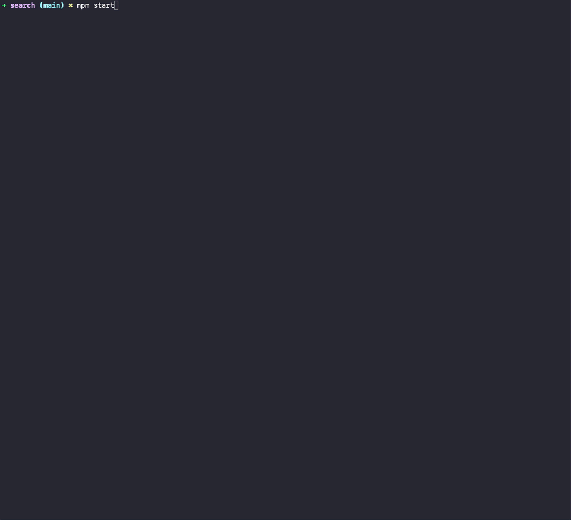

# Search <!-- omit in toc -->

https://github.com/linda-lai/search

## Summary <!-- omit in toc -->

A simple search application for the command line written in Node.js.

- [Getting Started](#getting-started)
  - [Prerequisites](#prerequisites)
  - [Installation](#installation)
  - [Run Application](#run-application)
  - [Run Tests](#run-tests)
  - [Code Formatting](#code-formatting)
  - [Usage Instructions](#usage-instructions)
- [Requirements](#requirements)
- [Motivations](#motivations)
- [Technical Decisions](#technical-decisions)
  - [Approach](#approach)
  - [Performance](#performance)
- [Error Handling](#error-handling)
- [Assumptions & Limitations](#assumptions--limitations)
- [Enhancements & Improvements](#enhancements--improvements)

## Getting Started

### Prerequisites

> NB: Not tested on Linux and Windows.

The application has been built with Node.js, and is intended to run on Node v.14.15.4 (but should run without problems on Node v11.x.x or higher).

- Homebrew
- Node v14.15.4

Install Homebrew:

```bash
$ /usr/bin/ruby -e "$(curl -fsSL https://raw.githubusercontent.com/Homebrew/install/master/install)"
```

Install Node v14.15.4:

```bash
$ brew install node@14.15.4
```

### Installation

To get this up and running in your local development environment, install the required dependencies from the root of the project:

```bash
$ npm install
```

### Run Application

To run the application, execute from the root of the project:

```bash
$ npm start
```

The app depends on data from JSON files that are loaded on initialization from the `./data` folder.

### Run Tests

The `test-utils.js` file contains lightweight, custom test utils with basic matchers using Node's native `assert` library. The `describe`, `test` and `expect` helpers it exposes mimic the methods and matchers provided in common JavaScript test libraries like Jest and Mocha.

To run the tests:

```bash
$ npm test
```

To run the tests in watch mode:

```bash
$ npm run test:watch
```

### Code Formatting
Code formatting is managed by Prettier. Editors should recognise it's being used via the `.prettierrc.json` file, but to run Prettier:

```bash
$ npm run prettier
```

### Usage Instructions

The entry point for the application is the `lib/index.js` file. After running `npm start`, the application will wait for user inputs to form the search query:

- User inputs for `value` searching for a string must be JSON-formatted - i.e. wrapped in double quotes (`"Linda"`, not `Linda` or `'Linda'`). Search values for all other queryable data types don't need to be JSON-formatted (e.g. `123`, `true`, `null`, etc).
- Querying for `null` returns records with fields with a value of `null`, and records missing that field and value entirely (i.e. that are `undefined`).
- Querying for empty values (`""`) returns records with fields with an empty string value.

```
Q: Which entity are you querying?

🔎 Queryable collections are:
tickets
users
organizations

A: tickets

🔍 Searchable fields in TICKETS are:
_id
url
external_id
created_at
type
subject
description
priority
status
submitter_id
assignee_id
organization_id
tags
has_incidents
due_at
via

Q: Which field do you want to search?
A: _id

Q: What value are you looking up? e.g. "en-AU", 123, true, null, ""
⚠️  Note: Strings must be JSON-formatted (i.e. "admin" not admin or 'admin')
A: "436bf9b0-1147-4c0a-8439-6f79833bff5b"
```

| Demo                                                                                        |
| ------------------------------------------------------------------------------------------- |
|  |
## Requirements

> [See REQUIREMENTS](./docs/REQUIREMENTS.pdf)

## Motivations

This solution to the Zendesk coding challenge is the result of Lab Day pairing sessions with [@lcampbell-zendesk](https://github.com/lcampbell-zendesk) for the purposes of teaching and technical mentoring.

As a former intern, the search coding challenge used for engineering hiring is different to the ticket viewer I'd completed previously, and touches on higher level design principles and computer science concepts we used to guide our pairing sessions.

The goal on completion was publish the code internally and get Zendesk engineers to review it as if it were for a ZEN3/ZEN4 candidate and give us honest feedback.

So, feedback and reviews welcomed and appreciated!

## Technical Decisions

### Approach

The approach taken here focuses on simplicity > [enterprise grade implementation](https://github.com/EnterpriseQualityCoding/FizzBuzzEnterpriseEdition). The requirements hint that while the problem definition is pretty basic, search can get complicated pretty easily. So the design aims for the simplest implementation upfront rather than an exhaustive implementation. The goal was to arrive at a solution that is readable, testable, appropriately performant and easily extensible while meeting all the requirements. With appropriate benchmarks and abstractions so the code is easy for our future selves and more importantly, for other engineers to understand, is flexible and able to scale in future as needed.

In short:

- Simplicity and readability as first principles.
- Keep the solution lightweight - minimal boilerplate.
- Do It Yourself - minimal third party libraries to maximise learning:
  - `readline-sync` to manage user inputs
  - `nodemon` for local development
  - `prettier` for code formatting
- Avoid premature optimizations, and use benchmarks to measure performance.

### Performance

The search algorithm uses JavaScript's inbuilt `.filter` array method which has a time complexity of `O(N)`.

The approach was to avoid premature performance optimizations and use benchmarks at the end to assess:

- Whether performance optimizations are needed in the first place
- If needed, what part of the code should be optimized
- Metrics to use as a baseline to measure whether optimizations added have made performance better or worse

Premature optimization can explode development time while hurting code cleanliness, and can even backfire and cause suboptimal performance.

It being a search application first and foremost, I created a [`benchmark.js`](https://github.com/linda-lai/search/blob/main/test/benchmark.js#L26-L37) util in `/tests` to measure the runtime for the `search` function specifically, using the provided `users.json` data and a `large-users.json` test file with 10K+ entries with the same query.

To run the `benchmarks.js` test:

```bash
$ npm run test:benchmark
```

Here's a sample of the runtimes:

```bash
# 1. ➜ search (main) ✗ node test/benchmark.js
benchmarkDefaultData: 0.204ms
matching results: 75

benchmarkLargeData: 3.935ms
matching results: 17325

# 2. ➜ search (main) ✗ node test/benchmark.js
benchmarkDefaultData: 0.163ms
matching results: 75

benchmarkLargeData: 3.348ms
matching results: 17325

# 3. ➜ search (main) ✗ node test/benchmark.js
benchmarkDefaultData: 0.174ms
matching results: 75

benchmarkLargeData: 3.366ms
matching results: 17325
```

Under ~200ms should be relatively instantaneous to the user. So coming in ~3-4ms with the large users data, I'm confident the search algorithm is adequately performant and should gracefully handle a significant increase in the amount of data provided until it grows to a size where the use case for indexing the search algorithm is justified.

## Error Handling

| Error                                                                                            | Description                                 |
| ------------------------------------------------------------------------------------------------ | ------------------------------------------- |
|             | Error handling for user inputs              |
|  | Error handling for JSON loading and parsing |

## Assumptions & Limitations

- Case sensitive matching between `field` and `value` user inputs with `field` and `value` attributes in records - i.e. `_id` or `Miss Coffey` will match but `_ID` or `miss coffey` won't.
- Exact value matching - i.e. `Miss Coffey` will match but `Miss Coff` won't.
- Strings with special characters will only exact match queries with special characters - i.e. `Hotcâkes` will match but `Hotcakes` will not.
- Values are displayed in their original form, i.e. date values, timezones, etc.
- No indexing (based on current performance approach and benchmarks).
- No explicit ranking in the order of search results.
- There is enough memory to load the data and run the application on a single computer.
- Aside from relationships between entities for `getRelatedEntities` (`ticket_id`, `organization_id`, `assignee_id`, `submitter_id`), no assumptions made about the data structure of records, so fields can be added or removed in the entities as needed.
- Users can search any field in an entity. Fields displayed to the user and searchable by the user for the different entity types (and validation for the user input for `fields`) implicitly assume that all searchable fields exist in the first record, and that the collection contains at least one record.
- Users cannot search for fields/values missing in a record with `undefined` (as JSON parsing is used), so searches for `null` also handle `undefined` values in records.
- Only one value can be searched at a time.
- UI prompts and waits for user inputs rather than parsing command line arguments (making it harder to automate, further execution is blocked until input is received, etc).

## Enhancements & Improvements

- Fuzzy matching for partial or imprecise search matching.
- Use more performant search algorithm than `.filter`, i.e. indexing attributes (with the tradeoff of more expensive operations upfront to load and index data).
- Implement command line flag parsing instead of user prompts to manage input (for easier automation).
- Exit condition in prompt UI so users can quit at any point for better UX.
